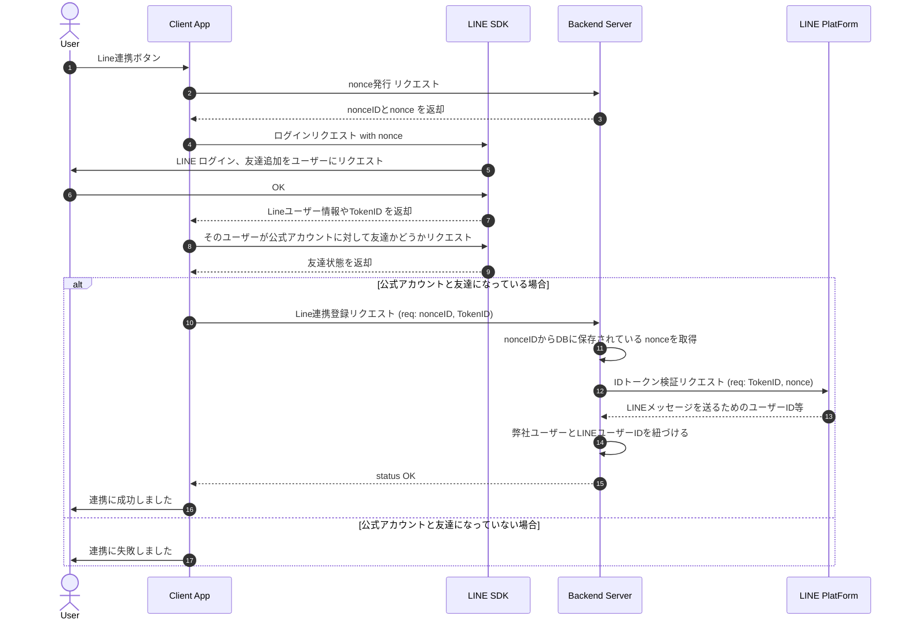

# はじめに

こんにちは、[助太刀](https://zenn.dev/p/sukedachi_dev)バックエンドチームの[水本](https://twitter.com/kiriha5123)です！

今回は、LINEとのアカウント連携を行い、Messaging APIを活用してメッセージを送信する方法について紹介したいと思います。
2024年10月7日に LINE Notify が[サービス終了の告知](https://developers.line.biz/ja/news/2024/10/07/line-notify-will-be-discontinued/)を出したこともあり、タイムリーな話題かもしれません。ぜひお付き合いください！

# Messaging API とは

Messaging APIは、LINE公式アカウントとLINEユーザーとのコミュニケーションをより便利にするためのAPIです。応答メッセージを送ったり、任意のメッセージを送信したり、リッチメニューを利用したりと、さまざまな機能を提供しています。
ただし、LINE Notifyとは異なり、毎月一定数以上のメッセージを送信する場合は料金が発生することに注意が必要です。

@[card](https://lineapiusecase.com/ja/api/msgapi.html)
@[card](https://developers.line.biz/ja/docs/messaging-api/overview/)
@[card](https://www.lycbiz.com/jp/service/line-official-account/plan/)

# 活用方法
今回は、サービスのユーザーに対して任意でLINEとのアカウント連携を行い、連携したユーザーに対してLINEを通じてメッセージ通知を行う方法を解説します。

# 実装イメージ
上記の目的を達するために、LINEのドキュメントを参考にしながら以下のようなシークエンス図のような設計を行いました。

@[card](https://developers.line.biz/ja/docs/line-login/secure-login-process/#using-openid-to-register-new-users)



### シークエンス図の補足説明
 1. ユーザーがLINE連携ボタンをクリック：アプリ上でLINE連携を希望するユーザーがボタンをクリックします。
 2. Client AppがBackend Serverにnonce発行リクエスト：セキュリティを高めるため、サーバー側で一意のnonceID, nonceを発行します。
 3. Backend ServerがnonceIDとnonceを返却：nonceは後でIDトークンの検証に使用します。
 4. Client AppがLINE SDKにログインリクエスト：SDKを使用して、nonceを含めたログインリクエストをLINEに送信します。
 5. LINE SDKがユーザーにログインと友達追加をリクエスト：ユーザーはLINE上で認証と公式アカウントの友達追加を求められます。
 6. ユーザーが認証・認可を許可：ユーザーがログインと友達追加を承認します。
 7. LINE SDKがClient Appにユーザー情報とIDトークンを返却：ログイン成功後、LINEからユーザー情報とIDトークンが返ってきます。
 8. Client AppがLINE SDKに友達状態をリクエスト：公式アカウントとユーザーが友達であるかを確認します。
 9. LINE SDKが友達状態を返却：友達になっているかの情報を受け取ります。

- 友達である場合
 10. Client AppがBackend ServerにLINE連携登録をリクエスト：nonceIDとIDトークンをサーバーに送信します。
 11. Backend Serverがnonceを取得し、IDトークンを検証リクエスト：nonceIDからnonceを取得し、LINEのAPIでIDトークンの検証を行います。
 公式の`POST https://api.line.me/oauth2/v2.1/verify` を使用しました。
@[card](https://developers.line.biz/ja/reference/line-login/#verify-id-token)
 12. Backend ServerがLINEユーザーIDを取得し、ユーザーと紐付け：検証が成功したら、弊社ユーザーとLINEユーザーIDをデータベースに保存します。
 13. Client Appがユーザーに連携成功を通知：連携が成功した旨をユーザーに表示します。

- 友達でない場合
 14. Client Appがユーザーに連携失敗を通知：連携が失敗した旨をユーザーに表示します。


このように実装することで、弊社のユーザーとLINEユーザーIDを紐付けることを検証できました。


# セキュリティ上の注意点
nonceはLINEの公式ドキュメントでも推奨されており、セッションを一意に識別し、セキュリティを強化するために用いられます。
この実装に従うことで、IDトークンの検証時にセッションの一環線を確認し、不正アクセスのリスクを低減できます。

- 一意性の確保：nonceは一意で予測不能な文字列である必要があります。同じnonceを複数回使用すると、リプレイ攻撃のリスクが高まります。
- 有効期限の設定：nonceには有効期限を設定し、一定時間が経過したnonceは無効化することでセッションハイジャックを防ぎます。

# メッセージ送信部分について
弊社バックエンドでは、PHP,Laravelを使用しています。
そこで、メッセージの送信部分においては、 `LINE Messaging API SDK for PHP`というLINE公式のSDKがあるため、簡単に実装することができます！

@[card](https://github.com/line/line-bot-sdk-php)

さらに、メッセージのデザインに関しては、LINE公式が提供している`Flex Message Simulator`を活用しました。これにより、デザイナーが弊社のデザインガイドラインに沿ったメッセージを直感的に作成でき、エンジニアとのコミュニケーションコストを削減することができました。`Flex Message Simulator`で作成したJSONデータをそのままコードに反映できるため、実装もスムーズに進められました。

@[card](https://developers.line.biz/flex-simulator/)

:::details 単体メッセージの実装イメージ（実際の実装とは異なります）
```php

use GuzzleHttp\Client;
use LINE\Clients\MessagingApi\Api\MessagingApiApi;
use LINE\Clients\MessagingApi\Configuration;
use LINE\Clients\MessagingApi\Model\ErrorResponse;
use LINE\Clients\MessagingApi\Model\PushMessageRequest;
use LINE\Clients\MessagingApi\Model\PushMessageResponse;

class LineMessageClient
{
    public function __construct(
        private readonly Client $httpClient,
        private MessagingApiApi $messageApi
    ) {
        $this->messageApi = new MessagingApiApi(
            client: $this->httpClient,
            // ここでLINE Messaging APIのチャネルIDを設定する。
            config: (new Configuration())->setAccessToken(env('LINE_BOT_CHANNEL_ACCESS_TOKEN'))
        );
    }

    public function send(): ?PushMessageResponse
    {
        // LINEメッセージの中身
        $contents =[
            'type' => 'bubble',
            'body' => [
                'type'     => 'box',
                'layout'   => 'vertical',
                'contents' => [
                    [
                        'type'   => 'text',
                        'text'   => '記事テスト',
                        'weight' => 'bold',
                        'size'   => '18px',
                        'color'  => '#141414',
                        'wrap'   => true
                    ],
                    [
                        'type': 'text',
                        'text': '今回は、弊社が運用しているサービスでLINE連携を行なってメッセージがLINE経由で届くようにした話を共有したいと思います。',
                        'size': '14px',
                        'color': '#6e6e6e',
                        'maxLines': 2,
                        'wrap': true
                    ]
                ],
                'paddingTop'    => 'xl',
                'paddingStart'  => 'xl',
                'paddingEnd'    => 'xl',
                'paddingBottom' => 'xl',
                'spacing'       => '4px'
            ],
            'footer' => [
                'type'     => 'box',
                'layout'   => 'vertical',
                'spacing'  => '4px',
                'contents' => [
                    [
                        'type'   => 'button',
                        'style'  => 'secondary',
                        'height' => 'sm',
                        'action' => [
                            'type'  => 'uri',
                            'label' => 'website',
                            'uri': 'https://company.suke-dachi.jp/'
                        ],
                        'color' => '#FABE00'
                    ]
                ],
                'paddingStart'  => 'xl',
                'paddingEnd'    => 'xl',
                'paddingTop'    => 'none',
                'paddingBottom' => 'xl'
            ]
        ];
    

        $message = new FlexMessage([
            'type'     => 'flex',
            // Push通知の部分に表示されます
            'altText'  => 'Push通知で出てくるところ'
            'contents' => $contents
        ]);

        $messageRequest = new PushMessageRequest([
            // 送信対象のLINEユーザーID
            'to'       => 'line_user_id'
            'messages' => [$message]

        return $this->messageApi->pushMessage($messageRequest);
    }
}

```

:::

上記実装イメージで送信されるもの

| Push通知                                    | LINEアプリ                                    |
| --------------------------------------------- | --------------------------------------------- |
|  |  |


# まとめ
LINEのMessaging APIとLINEログインを活用することで、ユーザーとのコミュニケーションをより円滑に行うことができます。また、公式のSDKやツールが充実しているため、実装も比較的容易です。特に、Flex Message Simulatorを活用することで、デザイナーとエンジニアの連携がスムーズになり、開発効率が向上します。

今後も新しい技術やサービスが登場する中で、最新の情報をキャッチアップし、適切に活用していくことが重要だと感じました。皆さんもぜひLINEの各種APIを活用して、サービスの価値向上に役立ててみてください。

# 助太刀について
助太刀では一緒に開発してくれるメンバを募集してます！
少しでもご興味を持っていただけたら下記よりお気軽にご連絡ください！

@[card](https://suke-dachi.jp/company/recruit.html#open-positions)

# 参考記事
- [LINE developersドキュメント](https://developers.line.biz/ja/docs/)
- [Flex Message Simulator](https://developers.line.biz/flex-simulator/)
- [LINEで始めるアプリ開発](https://codezine.jp/article/detail/17401)
- [PHPでLINEBotを作成してみた](https://qiita.com/tsu4o/items/0a2520c9cc941e6066c3)
