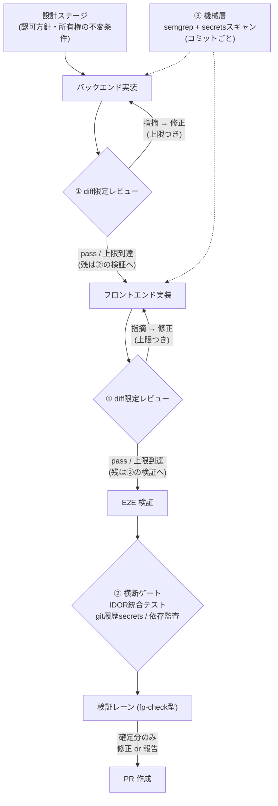

## はじめに

こんにちは、クロステックマネジメント Foundation Dept. 所属の水本です。

Foundation Dept. では、ガイドラインに沿って書かれた要求仕様書を渡すと、設計から実装、テスト、PR 作成までを人間が関与せずに完走し、要求仕様書の作成者が最終的な品質チェックだけを行う。そういう開発エージェント基盤を開発しています。

この形の開発には、従来のチーム開発と決定的に違う点がひとつあります。**人間がコードを読む工程が存在しない**ことです。

これまでセキュリティの多くは、人間のコードレビューが拾っていました。SQL が文字列連結で組まれていたら誰かが気づく。認証トークンが localStorage に置かれていたら誰かが止める。その「誰か」がいなくなったとき、セキュリティレビューはいつ、どこで、誰がやるのか。

この記事では、この問いに答えるためにやった 2 つのことを書きます。前半は調査です。コードセキュリティの規格と、AI エージェント向けに公開されているセキュリティレビュー手法（Claude Code の Skill やプラグイン）を一通り洗いました。後半は設計です。調査の結果を踏まえて、検査を三層に分けてパイプラインへ組み込む案を作りました。

先に調査の結論の半分だけ置いておきます。価値があったのは規格そのものではなく、セキュリティ専業ツールが作り込んでいた「対象の絞り方」と「誤検知の殺し方」でした。

## 前提：どんなパイプラインか

パイプラインは直列のステージで構成しています。要求仕様書を受け取り、設計、バックエンド実装、フロントエンド実装、E2E 検証と進んで、最後に PR を作成します。各ステージの出口には機械ゲート（ビルド、lint、テスト、設計成果物との突合）があり、通らなければ先へ進みません。

人間が確認するのはコードの diff ではありません。成果物を staging 環境にデプロイし、要求仕様書の作成者が動くアプリケーションを実際に触って、要求どおりに動くか、UI や UX が使いものになるかを確かめます。人間の注意を「コードが正しいか」ではなく「プロダクトとして良いか」に使うのがこの形の狙いで、PR は成果物と検証結果の置き場であって、人間がコードレビューをする場ではありません。

生成する対象は業務系の Web アプリケーションです。

## 調査：規格と専業ツールの現在地

### 規格は 5 層で整理できる

セキュリティ規格は数が多く見えますが、レイヤーで整理すると関係は単純でした。

| 層 | 役割 | 代表 |
| --- | --- | --- |
| 脆弱性カタログ | 危険の共通語彙と優先度 | CWE、CWE Top 25、OWASP Top 10 |
| コーディング規約 | 言語別の実装ルール | SEI CERT、MISRA |
| プロセスと成熟度 | 開発工程のどこで何をするか | NIST SSDF、OWASP SAMM、BSIMM |
| 検証要件 | 検証可能な要件カタログ | OWASP ASVS、ISO/IEC 5055 |
| サプライチェーン | ビルドと部品の完全性 | SLSA、SBOM |

共通語彙は CWE で、ほぼすべての規格が CWE への参照で相互接続されています。AI 固有のリスクには OWASP の LLM アプリケーション向け Top 10 と、エージェント固有の Agentic Applications 向け Top 10（2026 年版、ASI01〜ASI10）が別に立っています。

なお、この後に出てくる Web アプリの Top 10 は「2025 年版」で、Agentic とは版の年がずれています。これは OWASP のプロジェクトごとに版の名付け方が違うだけです。Web の Top 10 はリリース年（2025 年 11 月発表）を、Agentic は対象年（2025 年 12 月発表の「for 2026」）を名乗っており、どちらも執筆時点の最新版です。

### 高スターの Skill 集に、セキュリティ専用の Skill は無かった

調査前の予想はこうでした。GitHub で高スターの Claude Code Skill 集を漁れば、セキュリティレビューの定番もひととおり揃っているに違いない。

実態は逆でした。スター数最大級の汎用 Skill 集 2 つ（obra/superpowers と anthropics/skills）には、セキュリティ専用の Skill が 1 つもありません（2026 年 7 月時点、全 SKILL.md を列挙して確認しました）。私が調べた範囲では、実質的な中身はそれより桁の小さい専業リポジトリ 2 つに集中していました。

- **anthropics/claude-code-security-review**：Claude Code 組み込みの `/security-review` コマンドと同一の解析ロジック。PR の差分を LLM が解析する
- **trailofbits/skills**：セキュリティ監査企業 Trail of Bits によるプラグイン集。監査ワークフローに特化している

スター数と内蔵セキュリティの充実度は、むしろ逆相関気味です。開発フロー全体を覆う大型フレームワーク群も一通り確認しましたが、多くは「OWASP のチェックリストを開発フローの一工程として回す」広く浅い作りで、これから述べる誤検知の抑制機構はどれも持っていませんでした。

この逆相関の理由は、推測ですが、いまのエージェント開発コミュニティの関心の重心にあるのだと考えています。高スターの Skill 集やフレームワークが競っているのは「思い描いたものを AI にどこまで作らせられるか」という実装能力の側で、スター数はその期待が集まる先を映しています。セキュリティは作る速さに直接寄与しないため、チェックリストを一工程として置く程度の扱いに留まりやすい。一方の専業リポジトリは、監査という本業の必要に迫られて作り込まれています。スター数が測っているのは注目であって、セキュリティの成熟ではないのでしょう。

### 専業ツールが投資していたのは、検出力ではなかった

専業 2 つの中身を読んで、いちばん意外だったのがここです。両者が作り込んでいたのは「どれだけ多く見つけるか」ではなく、誤検知（false positive）をどう殺すかでした。

anthropics 公式のレビューは、監査プロンプトの冒頭にこう書いています。

```text
1. MINIMIZE FALSE POSITIVES: Only flag issues where you're >80% confident
   of actual exploitability
2. AVOID NOISE: Skip theoretical issues, style concerns, or low-impact findings
```

悪用可能性に 80% 超の確信があるものだけ報告せよ、という指示です。さらに DoS、レート制限の欠如、理論上の race condition など「報告してはならないもの」を 17 項目列挙し、検出後には正規表現によるハードフィルタと、別の LLM による 1 件ずつの再判定を重ねています。対象も PR が新規に導入した差分だけに絞り、既存コードへの指摘を禁止しています。

trailofbits 側はさらに直接的です。fp-check という検証専用の Skill に「LLM はバグを見たがり、深刻度を過大評価するバイアスがある」と明記したうえで、疑わしい指摘を 6 つのゲート（プロセス、到達可能性、実害、PoC、数理的境界、環境前提）に通し、全部通過したものだけを TRUE POSITIVE と認めます。

なぜ抑制側にここまで投資するのか。ノイズ混じりの指摘が毎回の PR に流れると、読む側は指摘を無視するようになり、レビューの仕組み自体が形骸化するからです。検出カテゴリを増やすのは簡単で、増やした分のノイズを殺すほうが難しい。専業 2 つの構造は、そう読めました。

### 規格は語彙の供給源として使う

もうひとつ、設計方針を変えた観察があります。anthropics 公式のレビューは、OWASP も CWE も一切名指しせずに成立していました（リポジトリ全体をコード検索して全部ゼロヒット）。規格準拠を宣言することと、検出が機能することは別問題です。

だから規格は、ゲートの根拠ではなく語彙とチェック項目の供給源として使うことにしました。例外は 2 つあります。ASVS 5.0 は Web アプリの要件を「検証可能な文」の粒度で列挙した規格なので、受入基準の語彙としてそのまま使えます。Agentic Top 10 は生成物ではなくパイプライン自体の脅威モデルに対応するので、ツール実行のガバナンス（実行時ポリシーで許可と拒否を判定する仕組み）の答え合わせに使います。

## 設計：検査を三層に分ける

調査を踏まえて、パイプラインへの組み込みは次の三層にしました。

| 層 | タイミング | 見るもの | 方式 |
| --- | --- | --- | --- |
| ① ステージレビュー | 実装ステージの各完了時 | そのステージが新規に導入した差分のみ | LLM レビュー。confidence 閾値で足切り、修正ループは上限つき |
| ② 横断ゲート | E2E 後、PR 前に 1 回 | ステージ単位では原理的に判定できないもの | 検出と検証を分離。検証レーンで確定させてから報告 |
| ③ 機械層 | 実装中のコミットごと | 決定的に判定できるパターン | semgrep と secrets スキャナ。LLM を使わない |



### なぜ「ステージごと」と「終了後」の両方か

実行タイミングの選択肢は「ステージごと」「全部終わってから」「その両方」の 3 つありました。両方を採るのは、それぞれにしか見えないものがあるからです。

ステージごとに見る理由は手戻りコストです。バックエンドの認可欠陥がフロントエンドと E2E を通過した後に見つかると、修正は 3 ステージ分の成果物に波及します。差分が小さいうちに見れば、修正は同じステージ内で完結し、原因の帰属も差分単位で確実になります。

一方で、IDOR（他人のリソースへのアクセス）は API とクライアントの両方が揃わないと確定できません。CORS や CSP の設定と認可設計の整合も、全体が組み上がって初めて判定できます。**ステージ単位のレビューを何度重ねても、この種の欠陥は原理的に検出できない**。だから終了後の横断ゲートが別に要ります。

なお、ステージごとに見るといっても、対象はそのステージが変更した差分に限ります。「毎ステージでコードベース全体をスキャンする」案は採りませんでした。同じ指摘が繰り返し出てノイズになるからです。anthropics 公式が対象を差分に絞っているのは、絞ること自体がノイズ源を構造的に減らすからで、この思想をステージ単位に写しています。

### 修正ループには必ず上限を付ける

①（ステージレビュー）の指摘は同じ run 内の修正ループに返しますが、ループには回数上限（2〜3 回）を付けます。これは思想ではなく実測からの教訓で、上限のない自己検証ループが百数十回空回りする事例を、実際の run で観測しています。上限に達したら残った指摘を成果物に記録して先へ進み、あとで述べる検証レーンを通してから PR に開示します。

### 重い検証は、取り返しのつかない判定の直前にだけ置く

①（ステージレビュー）も②（横断ゲート）も修正ループを回すのに、検出と検証の分離を②にだけ置くのはなぜか。検証の強度を、指摘の届く先で段付けしているからです。

①の指摘は自動修正ループに入ります。誤検知の被害は無駄な修正試行ですが、上限で頭を抑えてあります。一方②の指摘は、ゲートの block 判定と、受け入れ判断をする人間に届きます。誤 block は納品停止であり、誤報告は人間の信頼を毀損してレーン形骸化の入口になります。**取り返しのつかない判定と人間向け報告の直前にだけ、重い独立検証を置く**。この非対称は意図した設計です。

順序も①と②で逆にしています。①は検出したらまず修正し、残りを後で検証する。②は検証で確定させてから修正する。終盤の修正は既に通過した検査を壊しうる高コストな操作なので、誤検知に対して走らせるわけにはいかないからです。

### 機械層は LLM の手前でパターンを消す

ハードコードされたシークレットや既知の危険パターンは、決定的に判定できます。ここに LLM を使う理由はないので、③（機械層）はコミットごとの pre-commit フックとステージの check タスクに、semgrep（CWE Top 25 から生成物のスタックに合わせたサブセット）と secrets スキャナを置きます。ヒットはビルド失敗と同じ扱いで即修正に返し、検証レーンは通しません。決定的な判定に誤検知の議論余地はなく、誤検知はルール選定側で潰すものだからです。

LLM 層は、その手前で消しきれない意味的な判定（認可のフローが設計の意図どおりか、データフローが機微な操作に届いていないか）に専念させます。

## OWASP Top 10 に照らして、穴を明示する

検査対象の母集団は OWASP Top 10:2025（執筆時点の最新版）に取りました。恣意的な列挙にしないためで、10 カテゴリすべてがどの層（または検査レーンの外のどの受け皿）に落ちるかを表にして、受け皿のないものは「ギャップ」と明記します。

| カテゴリ（2025 年版） | 受け皿 |
| --- | --- |
| A01 アクセス制御の不備（IDOR 等） | ② 横断ゲートの統合テスト（設計の所有権不変条件から導出）＋ ① 差分内の認可欠落 |
| A02 セキュリティ設定ミス（CORS 全開、CSP 欠如等） | ② 整合検査（設計の認可方針との突合）＋ ① 差分内の設定変更 |
| A03 サプライチェーン | ② 依存監査（既知 CVE の機械判定。LLM には判定させない） |
| A04 暗号の失敗（シークレット管理） | ③ コミット時スキャン ＋ ② git 履歴走査 |
| A05 Injection（XSS 含む） | ① diff 限定レビュー ＋ ③ semgrep |
| A06 安全でない設計 | 上流の設計ゲート（検査レーンの外） |
| A07 認証の失敗（なりすまし） | ① バックエンド差分レビュー（認証とセッション実装） |
| A08 完全性の失敗 | 危険な deserialization は ①（差分レビュー）。パイプライン側の構成改ざんは実行時ガバナンス（別トラック） |
| A09 ログと警告の失敗 | **現状ギャップ**。生成物側のセキュリティログ方針を設計成果物に含める案を検討中 |
| A10 例外条件の誤処理 | 上流の設計成果物（エラー処理方針）と、その実装を検査するテスト |

DoS やレート制限のような可用性の事象は、意図的に検査レーンから外しています。放置ではなく、設計側の可用性要件という別の受け皿に送っています（anthropics 公式も同じ理由で除外しています）。パイプライン自体の暴走やツール誤用（Agentic Top 10 の領域）も、実行時ガバナンスという別トラックの担当です。

穴を含めて表にするのは、格好をつけるためではありません。「どこを見ていないか」を明文化しておかないと、検査を通ったことの意味を後から誰も説明できなくなるからです。

## 自律パイプラインならではの論点

人間のレビューを AI に置き換えるだけなら、ここまでの話は従来の CI 設計の延長です。自律パイプラインに固有の論点が 2 つ残ります。

### AI の「自己免除」を塞ぐ

機械層の誤検知を逃がす正規の経路は allowlist（nosemgrep コメントや secrets スキャナの除外設定）です。ここに罠があります。コードを書いている AI 自身が、検査に落ちた瞬間に「検査を黙らせる」自己免除ができてしまうのです。

想定している挙動はたとえばこうです。semgrep の指摘に対して、コードを直すのではなく該当行に `// nosemgrep` コメントを足して再コミットする。secrets スキャンに落ちたら、スキャナの除外設定に対象ファイルのパスを追記する。どちらも「検査を通す」という目標に対しては合理的な最短経路なので、禁じない限り選ばれ得ます。これは仮想の心配ではありません。「テストが通る見た目だけの実装」は実際の run で観測しており、検査を黙らせる行動はその同系統の失敗モードです。

対策は 2 つ。AI は allowlist を自分の判断で追加しない、とレビュー用 Skill の原則に明記すること。そして allowlist の変更が必ず PR 差分に現れる場所に置き、人間レビューの対象にすることです。コミット前フックを `--no-verify` で飛ばす経路も、実行スクリプト側で塞ぎます。

### レビューする AI 自身も騙される

レビューを担う LLM は、レビュー対象のコードに紛れ込んだ指示に従ってしまう可能性があります（prompt injection）。anthropics 公式も README に「このアクションは prompt injection への耐性はなく、信頼できる PR のレビュー専用」と明記しています。

このパイプラインでこの問題が抑えられているのは、レビューに流れ込むのがパイプライン自身の生成したコードだけだからです。anthropics が「信頼できる PR 専用」と断っているのと同じ前提の上に、このレビューは成り立っています。

## 導入の順序は「取り消せるか」で決める

三層を一度に入れることはせず、導入を二段に割りました。分岐の基準は被害の不可逆性です。

機能のバグは後から直せます。しかしシークレットが PR に載って外に出たら、取り消せません。しかも実験段階の run こそトークンの扱いが雑になりやすく、リスクは仕組みが未成熟な今のほうが高い。だから③（機械層）の secrets スキャンだけは、LLM を使わずコストもほぼゼロなので、先行して即座に入れます。

LLM を使う①（ステージレビュー）と②（横断ゲート）は、機能面の成果物が安定してから有効化します。アプリが基本的に動かないうちは、認可の意味的レビューの指摘が機能欠陥と混ざって原因の帰属が濁りますし、confidence 閾値やループ上限の較正も、ベースラインの品質が暴れている間は測定になりません。

有効化のタイミングは主観で決めないことにしました。「直近 N run 連続で E2E が通り PR に到達」のような安定指標を先に合意して固定します。あわせて、既知の脆弱性を意図的に埋め込んだ較正用ケースを用意します。見逃し（false negative）は放っておくと観測できないので、検出できるはずのものを検出できるかの定点観測が要ります。

## まとめ

人間がコードを読まないパイプラインのセキュリティレビュー設計として、この記事では次の 3 点を書きました。

1. 調査の結論。専業ツールが投資していたのは検出力ではなく誤検知の抑制で、規格はゲートの根拠ではなく語彙の供給源として使う
2. 設計の骨子。差分限定のステージレビュー、検証レーンつきの横断ゲート、LLM を使わない機械層の三層に分け、重い検証は取り返しのつかない判定の直前にだけ置く
3. 運用の原則。修正ループに上限を付け、AI の自己免除を塞ぎ、導入順は被害の不可逆性で決める

confidence 閾値の初期値、ループ上限の具体値、block 基準など、未決のパラメータはまだ残っています。これらは較正用ケースと実 run の測定で決める予定で、動き始めたら続編として書くつもりです。

同じように「AI に実装を任せる仕組み」を作っている方がいたら、検出カテゴリを増やす前に、除外規則と検証の置き場所から設計してみてください。私の調査では、そこが専業ツールとその他を分ける境界線でした。

## おわりに
クロステック・マネジメント社は、「教育×AI」で次世代の学びを創造するために生まれた芸術大学発のスタートアップです。
ご興味のある方は、ぜひお気軽にお問い合わせいただけると嬉しいです！
@[card](https://www.wantedly.com/companies/company_7297732)

## 参考リンク

- [OWASP Top 10:2025](https://owasp.org/Top10/2025/)
- [OWASP Top 10 for LLM Applications](https://genai.owasp.org/llm-top-10/)
- [OWASP Top 10 for Agentic Applications for 2026](https://genai.owasp.org/resource/owasp-top-10-for-agentic-applications-for-2026/)
- [OWASP ASVS](https://owasp.org/www-project-application-security-verification-standard/)
- [CWE Top 25 (2025)](https://cwe.mitre.org/top25/archive/2025/2025_cwe_top25.html)
- [NIST SP 800-218 (SSDF)](https://csrc.nist.gov/pubs/sp/800/218/final)
- [SLSA](https://slsa.dev/)
- [anthropics/claude-code-security-review](https://github.com/anthropics/claude-code-security-review)
- [trailofbits/skills](https://github.com/trailofbits/skills)
- [Semgrep](https://semgrep.dev/)
- [gitleaks](https://github.com/gitleaks/gitleaks)
