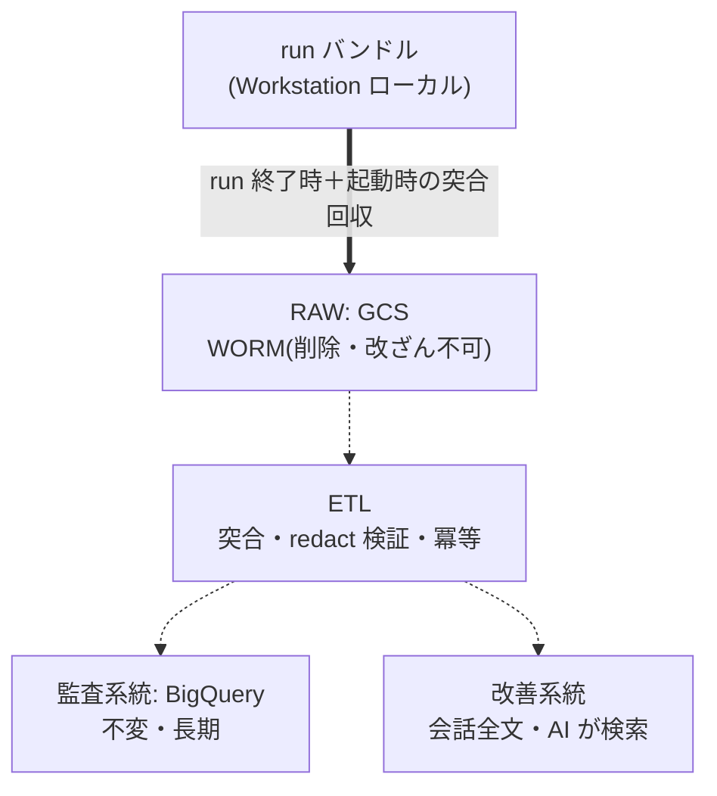

こんにちは、クロステックマネジメント Foundation Dept. 所属の水本です。

Foundation Dept. では、ガイドラインに沿って書かれた要求仕様書を渡すと、設計から実装、テスト、PR 作成までを人間が関与せずに完走し、要求仕様書の作成者が最終的な品質チェックだけを行う。そういう開発エージェント基盤を開発しています。

AI エージェントを業務で走らせ始めると、ログは勝手に増えていく。
会話の全文、ツール実行の入出力、ガバナンス機構の許可判定、LLM 呼び出しごとのコスト。
この基盤は、Docker が OSS として公開しているエージェントランタイム [docker-agent](https://github.com/docker/docker-agent) の上に組んでいる。
まだ運用前の開発段階だが、それでも 1 回の実行（run）で数千件のツールイベントと数十 MB の記録が残っていた。

取れている。
だが、管理はされていなかった。

すべてが個人の Cloud Workstations のローカルにあり、置き場所は run ディレクトリ、リポジトリ直下、`/tmp`、コンテナログとバラバラで、改ざん耐性もない。
エージェントに任せる仕事を増やすなら、この状態は放置できない。

そこで当初、「今出ているログを全部、中央に集めよう」という設計を進めかけた。
出ているものを漏らさず集めれば、少なくとも損はしないはずだ。
ところが、この前提はレビューで崩れることになる。
ログの選定は「今何が出ているか」からではなく「誰が何のために使うか」から始めるべきで、実際 [OWASP Logging Cheat Sheet](https://cheatsheetseries.owasp.org/cheatsheets/Logging_Cheat_Sheet.html) は「多すぎても少なすぎてもいけない。意図された用途の知識をもとに、何を、いつ、どれだけ記録するか決めよ」と明言している。

この記事は、AI エージェントのログを用途から設計し直した記録である。
選定基準の置き直しで何が変わったか、保存アーキテクチャをどう決めたか、そして「OpenTelemetry（OTel）に乗せればいいのでは」という当然の疑問に、なぜ「規格は使うが、正式データは預けない」と答えたかまでを書きます。

# ログの用途を先に決める

「全部集める」をやめて最初にやったのは、ログの使い手と使い道の列挙である。
洗い出すと 5 つに整理できた。
以降この記事では U1〜U5 の番号で参照する。

| # | 用途 | 誰が | いつ | 答える問い | 導出される要件 |
|---|---|---|---|---|---|
| U1 | セキュリティ監査 | セキュリティ担当 | 定期と事後 | 誰（どのエージェント）が、いつ、何をし、何が許可または拒否されたか | 改ざん耐性、長期保持、欠損ゼロ、非否認 |
| U2 | インシデント対応 | セキュリティ担当 | 異常検知時 | 今何が起きているか、被害範囲はどこまでか | リアルタイム転送、アラート、trace ID での追跡 |
| U3 | エージェント改善 | 改善エンジニアと改善エージェント（AI） | run 失敗後、定期ふりかえり | なぜ失敗したか、他プロジェクトでも同じ失敗をしていないか | 会話全文、横断検索、AI 可読、中期保持で足りる |
| U4 | コスト管理 | チームリーダー | 定期 | いくら使ったか、どのモデルが支配的か | LLM 呼び出しごとの粒度 |
| U5 | 運用監視 | CI と運用（自動） | 常時 | ガバナンスの統制は今も生きているか | 欠損検知、設定ハッシュの変化検知 |

表を作って気づくのは、同じ 1 本のログに複数の用途が乗ることだ。
たとえばツール実行のログは U1、U2、U3、U5 のすべてから要求される。

そして用途ごとに要求が違い、時に相反する。
U1 の監査は「不変、長期保持、アクセスは最小限」を求める。
U3 の改善は「検索しやすく、AI が読めて、保持は中期で足りる」を求める。
片方は凍らせたいデータで、もう片方は掘り返したいデータである。
この相反は後述する保存設計で「2 系統に分離する」という形で決着するのだが、分離の根拠が用途表から機械的に出てくる点は先に押さえておきたい。

# 何を物差しにするか

用途が決まれば、次は「その用途を満たすには何を記録すべきか」の基準がいる。
自前で考えるより、確立された標準に接地するほうが早いし、外部（監査や他部門）への説明可能性も手に入る。

ここでひとつ判断がある。
ログの主語が AI エージェントなので、「何を観測すべきか」の参照モデルには [OWASP Agent Observability Standard（AOS）](https://owasp.org/www-project-agent-observability-standard-2/)のイベントモデルを主レンズに使い、古典的なログ標準は「守り方の衛生基準」として下支えに回した。

| 標準 | 役割 |
|---|---|
| OWASP AOS | 主レンズ。エージェントは instrumentable、traceable、inspectable であれ。あらゆる行動を、その推論と発生元タスクまで遡れること |
| [OWASP Top 10 for Agentic Applications 2026](https://genai.owasp.org/resource/owasp-top-10-for-agentic-applications-for-2026/) | 脅威側のレンズ。全ツール呼び出しと判断の構造化ログ、replay（再生）能力、エージェント横断の trace ID を要求 |
| [OWASP Logging Cheat Sheet](https://cheatsheetseries.owasp.org/cheatsheets/Logging_Cheat_Sheet.html) | 衛生基準。記録すべきイベント種別と属性（when / where / who / what）、記録してはならないもの |
| [OWASP Top 10 A09（Security Logging and Alerting Failures）](https://owasp.org/Top10/2025/A09_2025-Security_Logging_and_Alerting_Failures/) | 「ログを取っていない、見ていない」こと自体が脆弱性であるという位置づけ |
| [NIST SP 800-92](https://csrc.nist.gov/pubs/sp/800/92/final) | ログ管理をライフサイクル（生成、転送、保存、分析、廃棄）で設計せよ |
| [ISO/IEC 27002:2022 Control 8.15](https://www.iso.org/standard/75652.html) | ログポリシーの文書化と改ざんからの保護 |

「何を取るかは AOS のイベントモデルを参照モデルに、どう守るかは古典標準に従う」という役割分担である。

## 棚卸しで見つかった 3 つのギャップ

標準の要求と現状のログを突き合わせると、主要イベントはおおむね網羅できていた。
会話と推論の全文、ツール実行の入出力、LLM 呼び出しごとのコスト、run と session と tool 呼び出しをつなぐ ID 体系（AOS の言う trace ID と replay 能力に相当）は揃っている。

足りないものは 3 つだった。

**1. 許可判定の成功側が消えている。**
ガバナンス機構（ツール呼び出しを allow / deny / ask で判定するフック）の記録のうち、永続化されていたのは deny だけで、allow はコンテナログにしか出ず揮発していた。
古典標準は認証と認可のイベントを「成否とも」記録せよと言う。
拒否だけ残して許可を捨てるのは、認可ログの半分を捨てているのと同じである。
ここは判定ログの書き手を改修し、allow / ask も含めた全量を run ディレクトリに永続化する形で解消した。

**2. 行為者の帰属が取れない。**
フックの入力に「どのエージェントがツールを呼んだのか」が含まれておらず、who が欠けたログは監査の一次要件（when / where / who / what）を満たさない。
これは docker-agent 側の問題だったので upstream に報告し、微力ながら修正 PR も出させてもらった（[docker-agent#3110](https://github.com/docker/docker-agent/pull/3110)、マージ済み）。
今は docker-agent を修正の入ったバージョン（v1.81.2 以降）へ上げれば解決する。

**3. 実行時に効いていた構成の記録がない。**
ポリシー定義の変更履歴は git と PR レビューで追える。
だが git にあるのは「あるべき姿」の履歴であって、run の時点で実際に効いていた構成（ローカル改変、デーモンの起動状態、フックをバイパスする実行時フラグ）の記録ではない。
そこで run 開始時に、構成のハッシュと git SHA、dirty フラグを run バンドル（ログと成果物の一式）へ焼き込む方式にした。
git と突合して不一致（つまりローカル改変）を検知する部分は、ETL とあわせて実装する。

3 つ目は棚卸しをやらなければ見つからなかったギャップで、「管理操作を記録せよ」という古典標準の要求を AI エージェント環境に翻訳したときに初めて見える穴だった。

## 選定の結論

現行ログ 6 系統（会話ログ、ツールイベント、判定ログ、コスト台帳、実行サマリと成果物、スクリプトの標準出力ログ）を U1〜U5 にマッピングした結論は、次の 3 行に要約できる。

1. 「全部集める」は結果的にほぼ正しかった。ただし根拠が「今出ているから」から「用途 U1〜U5 が要求するから」に変わり、外部に説明できる形になった
2. スクリプトの標準出力ログだけは用途の根拠が弱く、中央集約の対象から外れた。「全部」ではなくなった
3. 逆に、どの既存ログにも無い系統（実行時構成の記録）が新たに追加された

# 記録してはならないもの

選定基準には裏面がある。
OWASP は「秘密情報、鍵、パスワード、不要な PII（個人情報）をログに入れるな」と要求しており、「全部入れる」はここと正面から緊張する。
ツール実行の入出力や会話の全文には、秘密情報が混入しうるからだ。

対策は多層の関所として設計した。

```
第 1 層: 発生源 — docker-agent 組み込みのシークレットスクラバー（パターン検出、永続化前に置換）
第 2 層: ETL の関所 — gitleaks 系の追加パターンスキャン
第 3 層: 検証 — 生存確認 grep、偽トークンを仕込む canary テスト、定期スキャン
```

設計上の注意を 2 つ挙げる。

まず、redact（秘密情報のマスキング）は「あると良い」機能ではなく標準準拠の必須要件である。
会話全文を中央に置く判断は、redact の検証が通ることを前提条件にした。

もうひとつ、これは AI エージェント特有の増幅要因なのだが、U3 では**ログを AI が読む**。
ログから改善エージェントのプロンプトへ、そして生成物へという二次拡散の経路が生まれるし、ログ内容を経由した prompt injection の可能性もある。
ツール入力は攻撃者が制御しうる文字列なので、構造化 JSON のまま格納してテキスト連結しない（log injection 対策）ことと合わせて、読み手側の統制（AI 専用のサービスアカウント、read-only、アクセス監査）を一般的な Web システムより一段重く見積もった。

# 保存設計

用途とその相反が確定したので、保存はこう設計した。
現時点で動いているのは RAW（GCS）への収集までで、ETL から先は設計を終えて実装待ちの段階である。



要点は 5 つある。

**1. RAW を唯一の源にする。**
run バンドルを原本のまま GCS に置き、Retention Policy と Bucket Lock で管理者でも消せなくする（WORM）。
Bucket Lock は不可逆なので、保持期間が確定してからかける 2 段階にしている。
改ざん耐性はこの 1 箇所で担保し、下流の監査テーブルも改善データも、すべて RAW からの一方向の変換で再構築可能にする。
おまけとして、run 開始時に焼き込んだ構成スナップショット（ギャップ 3 の対策）も WORM に乗るので、改ざん不可の実行時証跡がタダで手に入る。

**2. 取りこぼしは起動時の突合で拾う。**
run 終了時のアップロードから漏れた run（kill、クラッシュ、Workstation ごと落ちた場合）は、Workstation の起動時にローカルの run ディレクトリと GCS を list 照合して回収する。
定期 cron にしなかったのは、Workstation が止まっている間は cron も動かず、動き出した瞬間に差分を埋めるほうが確実だからだ。
照合の正はアップロード完了マーカーで、途中で死んだアップロードはマーカーが無いため未完了とみなし、別 attempt として上げ直す（WORM なので上書きは起きない）。
書き込みが続いている run は実行中とみなしてスキップし、誤回収を防ぐ。
あわせて Workstation 側のサービスアカウントにはオブジェクトの作成と list だけを与え、読み出しは与えない。
エージェント自身は、自分が上げた監査ログを読み戻すことも書き換えることもできない。
当初の設計では、この回収と並走する補助線として、イベントを 1 行ずつ中央へ流す逐次転送も描いていた。
役割は 2 つ、取りこぼしの保険と、U2 のリアルタイム検知である。
前者はマーカーと突合で足りると分かったため、取りこぼし対策として逐次転送を足す動機は消えた。
後者の U2 は、まだ運用前で、アラートを受ける体制も検知対象も無く、経路だけ先に作っても成立しない。
そこで逐次転送は、現時点では実装しない判断をしている。
なお、突合が拾えるのはローカルに run ディレクトリが残っているケースまでで、Workstation ごと失われた run は検知できない。
この残余リスクと U2 のリアルタイム検知は、RAW を唯一の源とする形を保ったまま、要求が顕在化した時点で経路を足して埋める予定です。

**3. 用途で 2 系統に分ける。**
U1 の監査系統（不変、長期、アクセス最小）と U3 の改善系統（会話全文、検索性、中期保持）は要求が真逆なので同居させない。
ただし分離は監査からの隠蔽ではない。
アクセスは階層型で、監査担当は最上位として両系統を参照できる。
分けているのは AI のアクセス範囲と、保持期間とスキーマの独立性である。

**4. 欠損を検知可能にする。**
とはいえ、検知として今動いているのは 2 の完了マーカー（`_upload-marker.json`）だけで、ここから先は ETL とあわせて実装する設計の話になる。
監査向けのテーブルでは、ツール呼び出しの試行、判定、実行結果を ID で 1 レコードに突合し、判定記録のない実行を `verdict=unknown` として残す。
欠損を黙って落とすのではなく、欠損自体をクエリで数えられるようにする。
U5（統制は今も生きているか）の実体は、この unknown 監視と設定ハッシュの突合になる予定だ。
A09 の言う「ログの失敗自体が脆弱性」に対する回答も、ここに置くことになる。

**5. スキーマは結合キーだけ固定し、本文は JSON で持つ。**
当初は全項目を固定カラムに展開する案だったが、採らなかった。
BigQuery の固定カラムは追加こそ容易でも、型変更や削除はテーブル作り直し級の作業になり、フック由来のログは今後も項目が増減するからだ。
固定カラムは結合と検索に使うキー（run_id、session_id、tool 呼び出し ID、タイムスタンプ、verdict 程度）に限定し、残りは JSON 型の payload カラムに原形のまま保持する。
集計でよく使う項目が固まってきたら、ビューで JSON から取り出して昇格させればよい。

コストにも触れておくと、この構成のログ保存費用は、概算だと 1 run あたり数円で、LLM 費用に対して 2〜3 桁小さい。
ログを取らない理由にコストは使えない。

# それ、OTel でよくない？

ここまで読んで、「この形のデータ、どこかで見たことがあるような」と感じた読者もいるはずだ。
観測データの世界には、まさにこのための標準がある。
**[OpenTelemetry（OTel）](https://opentelemetry.io/docs/what-is-opentelemetry/)** だ。

OTel は、トレース、メトリクス、ログといった観測データの生成と輸送を標準化するフレームワークで、Kubernetes や Prometheus と同じ OSS 財団 CNCF（Cloud Native Computing Foundation）のプロジェクトである。
2026 年 5 月には CNCF が認定する最上位の成熟度（[Graduated](https://opentelemetry.io/blog/2026/otel-graduates/)）へ到達しており、この分野の事実上の標準になっている。
守備範囲は「アプリにデータを出させて、運ぶ」ところまでで、運ぶための共通プロトコルとして **OTLP**（OpenTelemetry Protocol）を持つ。
貯めて見せるのは Jaeger や Datadog、Langfuse といった監視バックエンドの仕事で、OTel 自体は監視ツールではない。

AI まわりで OTel の名前をよく聞く理由は、データモデルにある。
OTel の中心概念である**トレース**は、親子関係を持つ処理単位（スパン）の木で、リクエストがどこを通りどこで時間を使ったかを表す。
「推論 → ツール実行 → 再推論 → サブエージェントへ委譲」と枝分かれしていくエージェントの実行は、この木構造にそのまま重なる。
さらに OTel の上では、LLM まわりの属性名を揃える共通語彙 **GenAI Semantic Conventions**（`gen_ai.*`。以下 semconv）も策定されている。
モデル名は `gen_ai.request.model`、入力トークン数は `gen_ai.usage.input_tokens`、という具合に「何をどの名前で記録するか」を定めた規約である。

であれば、こう思うのが自然だ。
「試行と判定と結果を ID で突合するのは、スパンの親子関係そのものでは。独自スキーマを起こさずに、この標準に乗せればいいのでは」

そうしたかった、とは思う。
問題は現在地だ。
2026 年 7 月時点で、GenAI Semantic Conventions に Stable（安定版）は 1 つも無い。
スパンもメトリクスも、すべて破壊的変更がありうる Development ステータスにある。
しかも 2026 年 6 月にコアリポジトリから専用リポジトリ（semantic-conventions-genai）へ移管された直後で、移管先にはまだリリースタグが無い。
参照できるのは移管前の v1.42.0 か commit SHA だけで、**通常のバージョン固定運用に乗らない**。

属性名は実際に何度も変わってきた。

| 時期 | 変更 |
|---|---|
| v1.27.0（2024-08） | トークン数の属性を prompt / completion 系から input / output 系へ改名 |
| v1.37.0（2025-08） | `gen_ai.system` を非推奨化し `gen_ai.provider.name` へ改名。メッセージ本文も `gen_ai.input.messages` / `gen_ai.output.messages` へ再編 |
| v1.38.0（2025-10） | 評価イベント `gen_ai.evaluation.result` を追加 |
| v1.41.0（2026-04） | `invoke_agent` を client / internal に分割 |
| v1.42.0（2026-06） | 専用リポジトリへ移管 |

つまり Web 記事やダッシュボード例は、書かれた時期によって属性名の世代が違う。
`gen_ai.system` で書かれた資料はすべて旧世代である。

世代ズレはツール側にも現れている。
たとえば LLM オブザーバビリティバックエンドの Langfuse が入出力のマッピングで読むのは `gen_ai.prompt` / `gen_ai.completion` で、これは現行仕様の `gen_ai.input.messages` / `gen_ai.output.messages` より前の世代の属性名だ。
現行仕様どおりに送ると入出力が拾われない可能性がある、という状況が 2026 年時点の実務である。

## docker-agent 自身も OTel を話すが

もう一つ先回りしておくと、私たちが使っている docker-agent 自体にも [OTel 計装がある](https://docs.docker.com/ai/docker-agent/community/opentelemetry/)。
`--otel` フラグで有効化でき、エージェントのターン、モデル呼び出し（トークンとコスト属性つき）、ツール呼び出し、MCP のやりとり、サブエージェントへの委譲がトレースとして出る。
属性は `gen_ai.*` と `mcp.*` の semconv に沿っており、メッセージ本文の捕捉はデフォルト無効（オプトイン）という作法も仕様の推奨どおりだ。

では、これを有効にして OTLP バックエンドへ流せば終わりかというと、2 つの理由でそうならなかった。

第一に、取りたい情報が docker-agent のトレースより広い。
ガバナンス機構の判定（allow / deny / ask）は私たちがフック層で足した仕組みであり、docker-agent の計装には存在しない。
実行時構成スナップショットも同様である。
そして U1 の監査要件（WORM、欠損検知、非否認）は「トレースを OTLP で送る」というデータの流れでは担保できず、保存側の設計を別に持つしかない。

第二に、世代追従の問題がある。
docker-agent がどの世代の `gen_ai.*` を出すかは実装とバージョン次第で、利用者には制御できない。
semconv 側が Development のまま動き続ける以上、計装が追従しきれない期間や、アップグレードのたびに属性名が変わる事態は普通に起こりうる。
その出力を source of truth にすると、規約と docker-agent の両方の変化に監査データが振り回される。

docker-agent の OTel トレースは、消費層へ流す出口としては有力である。
ただし正式データの源は、フック由来の生ログ（RAW）に置く。

この現在地を踏まえた判断が、前節の設計の裏にある。

- **外部規約から独立した内部データモデルを持つ**。結合キーと JSON payload という内部スキーマは、GenAI semconv がどう変わっても影響を受けない
- **RAW を source of truth にしているので、OTel への写像は後からいくらでもやり直せる**。規約が変わったら変換 ETL を書き直して再生成すればよく、過去データも救える
- 消費層（Langfuse などの OTel バックエンド）へ流したデータのクエリは、新旧両属性名を coalesce する前提で組み、`gen_ai.*` 名前空間に独自属性を足さない（将来の仕様追加との衝突を避ける）

誤解のないように言うと、「OTel を使わない」という話ではない。
消費層への輸送と可視化では OTel の規格をそのまま使うし、Langfuse も OTLP で受ける OTel バックエンドである。
預けないのは正式データの形だけだ。
監査の source of truth は GenAI Semantic Conventions に直接依存させず、OTel へは変換層で写す。
規約が安定したら、変換層を書き直すだけで追従できる。

# 将来の構想

改善系統（U3）の UI としては、Langfuse を消費層として一方向に足す構成を検討している。
run バンドルのツールイベントを execute_tool スパンに、LLM 呼び出しごとのコスト台帳を generation（inference スパン相当）に写す変換 ETL を書けば、データモデルはほぼ 1:1 で対応する。
docker-agent の `--otel` を直接 Langfuse へ向ける近道もあり、リアルタイム性ではこちらが勝るが、前節の世代追従の注意と「判定ログが乗らない」制約は同じに残る。
どちらの経路でも、正式データは RAW 側にあるので使い分けは後から変えられる。

この構成の理由は、責務の線引きが OTel 自身の役割分担と一致するからだ。
OTel は計装と輸送を担い、保存と可視化はバックエンドの仕事と割り切っている。
こちらも監査の正式データは WORM の RAW と BigQuery が持ち、Langfuse は「再構築可能な消費層」に徹する。
Langfuse は mutable な分析ストアなので監査系統には使わない、という線引きもここから自然に出てくる。

ただし、このパートはまだ設計上の構想であり、変換 ETL の PoC は未実施である。
実装した際には記事にする予定です。

# まとめ

「取れてはいるが、管理されてはいない」から始まった話は、こう着地した。

- 選定は用途（U1〜U5）から導出する。結果として「全部」にほぼ戻ったとしても、1 本ごとに理由を言える状態には大きな差がある
- 物差しは AOS を主レンズに、古典ログ標準を衛生基準に。棚卸しは実際に 3 つの穴（allow の揮発、行為者の帰属、実行時構成）を見つけた
- 保存は WORM の RAW を唯一の源に、相反する用途を 2 系統に分離する
- OTel GenAI semconv は全部 Development で、まだ通常のバージョン固定運用に乗らない。内部データモデルを自前で持ち、OTel へは変換層で後から写す

エージェントに仕事を任せる範囲を広げるほど、「何をしたかを後から証明できるか」が効いてくる。
ログ設計は、その証明能力を先に買っておく行為なのだと思います。

# おわりに

クロステック・マネジメント社は、「教育×AI」で次世代の学びを創造するために生まれた芸術大学発のスタートアップです。
ご興味のある方は、ぜひお気軽にお問い合わせいただけると嬉しいです！
@[card](https://www.wantedly.com/companies/company_7297732)

# 参考文献

- [OWASP Logging Cheat Sheet](https://cheatsheetseries.owasp.org/cheatsheets/Logging_Cheat_Sheet.html)
- [OWASP Top 10:2025 A09 Security Logging and Alerting Failures](https://owasp.org/Top10/2025/A09_2025-Security_Logging_and_Alerting_Failures/)
- [OWASP Agent Observability Standard](https://owasp.org/www-project-agent-observability-standard-2/)
- [OWASP Top 10 for Agentic Applications 2026](https://genai.owasp.org/resource/owasp-top-10-for-agentic-applications-for-2026/)
- [NIST SP 800-92: Guide to Computer Security Log Management](https://csrc.nist.gov/pubs/sp/800/92/final)
- [What is OpenTelemetry?](https://opentelemetry.io/docs/what-is-opentelemetry/)
- [OTel Graduates（OpenTelemetry 公式ブログ）](https://opentelemetry.io/blog/2026/otel-graduates/)
- [semantic-conventions-genai リポジトリ](https://github.com/open-telemetry/semantic-conventions-genai)
- [Langfuse OpenTelemetry 属性マッピング](https://langfuse.com/integrations/native/opentelemetry)
